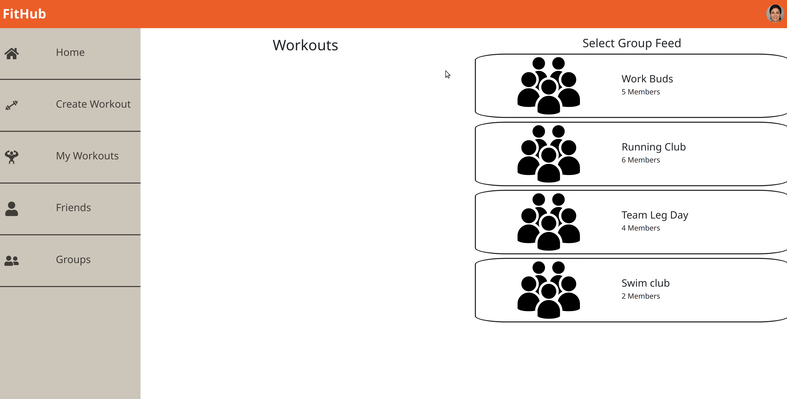
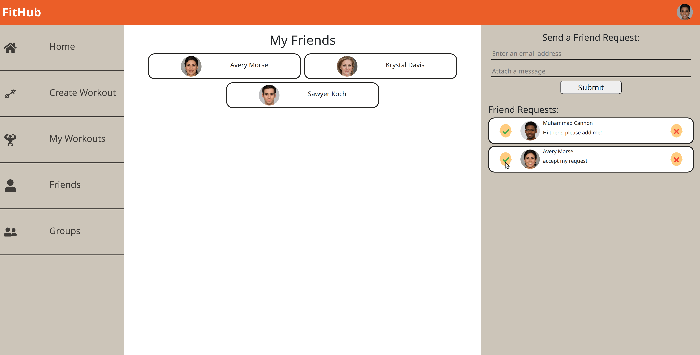

# FitHub

Ever since covid, it has been extremely difficult to keep up with personal fitness goals. We feel disconnected with others, rather spend our times being a couch potato than doing some push ups to keep our bodies in shape.

FitHub is a social fitness application that focuses on community. Having a strong emphasis on buiding and maintaining a community, users can create a group on FitHub to share their workouts and participate other workout routines posted in groups by other users.

Workout builder is another main feature of Fithub. For this project we used [Exercise DB API](https://rapidapi.com/justin-WFnsXH_t6/api/exercisedb/) to fuel Fithub with exercise information and guidance GIF. When building an exercise, users can find the exercise they want by searching exercise name or clicking buttons that display body part specific exercises. Users can also define the sets and reps for an exercise.

For user's that want to follow a working. Clicking on the start workout button, a guidance GIF will appear along with the number of reps and sets of the current exercise.

## Features

- Exercises can be built into a workout
- Friend system
- Exercise guidance page
- Search for a specific exercise
- Users can signup and login
- Users can publish a workout
- Users can view workouts published by other users
- Users can create a group with their friends

## Screenshots

## Setup

Install dependencies with `npm install` in the `client` and `server` directory

Setting up databse schema's and seeds `npm run db:reset` in `server` directory

## Running Webpack Development Server

`npm start`

## Dependencies

- React
- Express
- jsonwebtoken (JWT)
- axios
- bcrupt
- classnames
- proptype
- cookie-parser
- cors
- pg
- pg-native
- margan
- nodemon
- dotenv

## Testing

- Storybook
- Jest
- Cypress

## Contributors

This project is made possible by:

- [Kyle Forsyth](https://github.com/cupokyle)
- [Juliet Li](https://github.com/Julietmtl)
- [William Ye](https://github.com/zeeplo)
